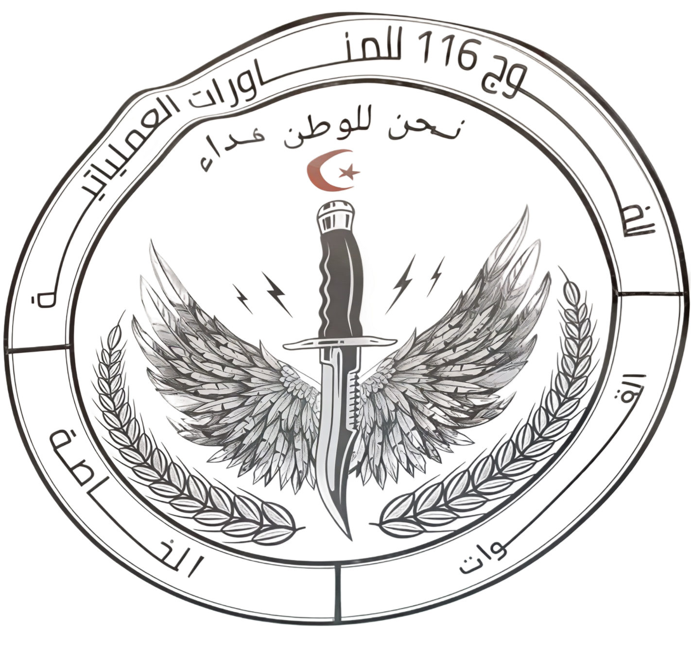
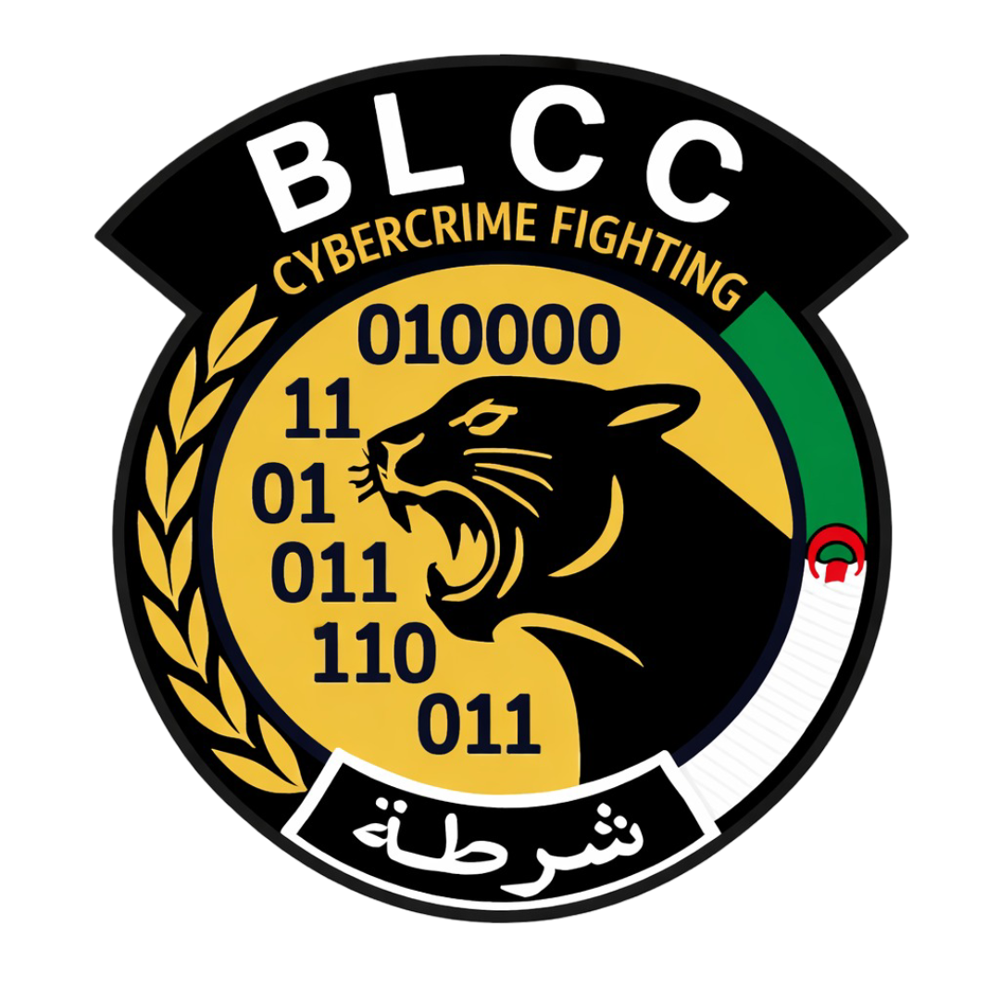
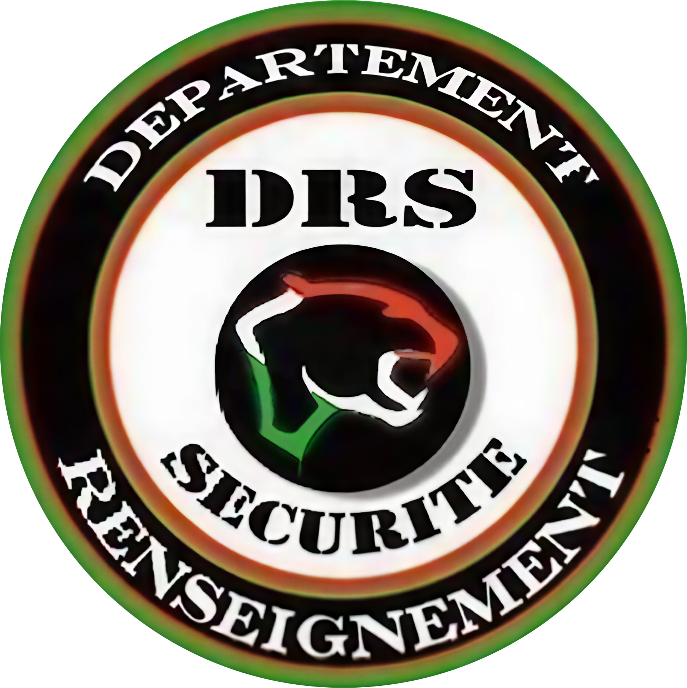
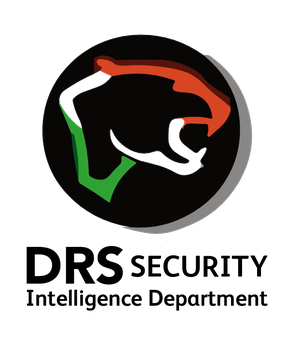
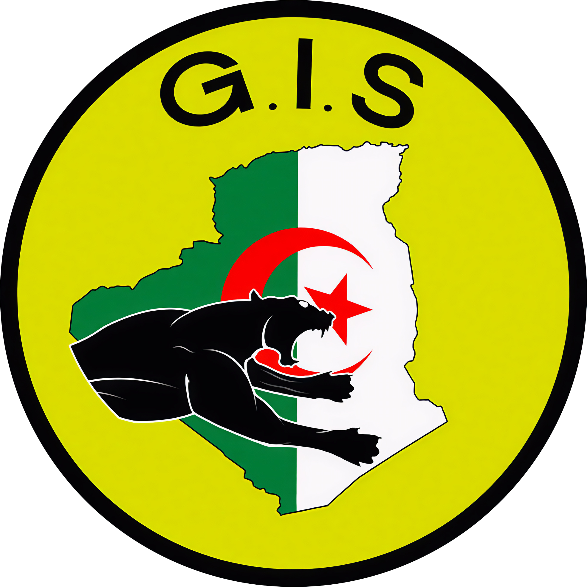
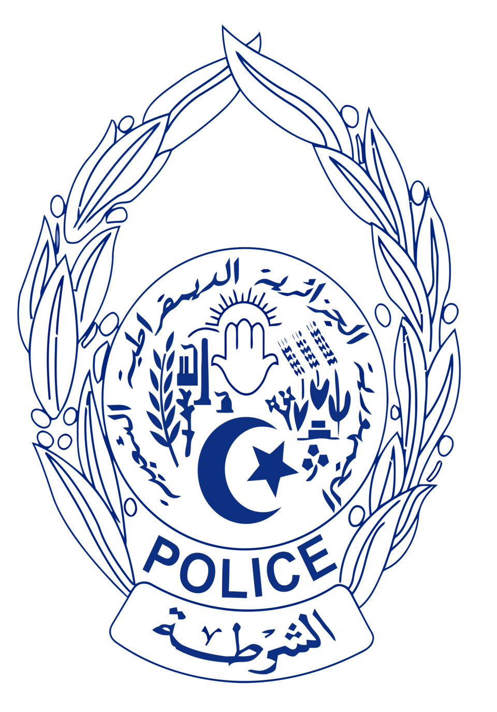
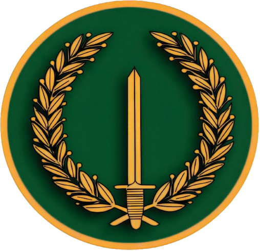
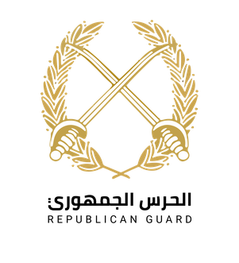
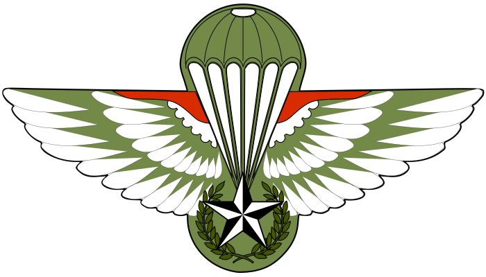
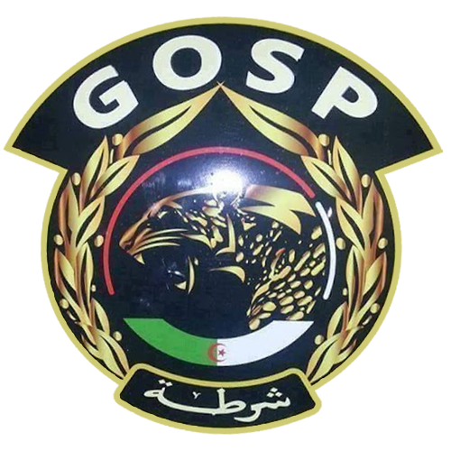

# logos

Unit | Logo
--- | ---
116th Operational Maneuvers Regiment (116th RMO) | 
BLCC | 
Department of Intelligence and Security (DRS) | 
Department of Intelligence and Security (DRS) | 
Special Intervention Group (GIS) | 
Directorate General for National Security (DGSN) | 
National Gendarmerie | 
Special Intervention Regiment (RSI)| 
Special Forces of Algeria | 
Police Special Operations Group (GOSP) | 
The Navy Special Action Regiment (RASM) | 
